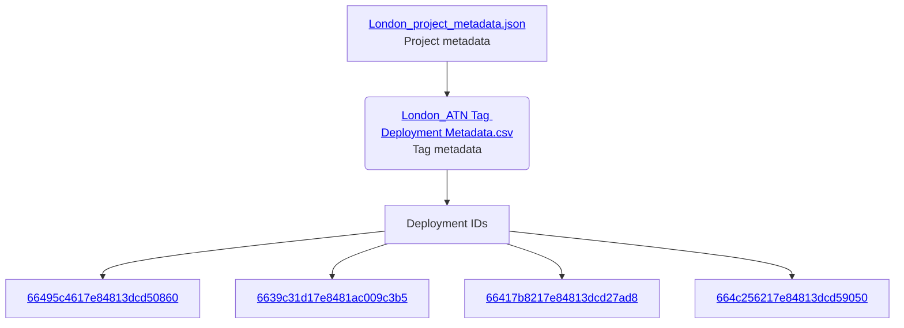
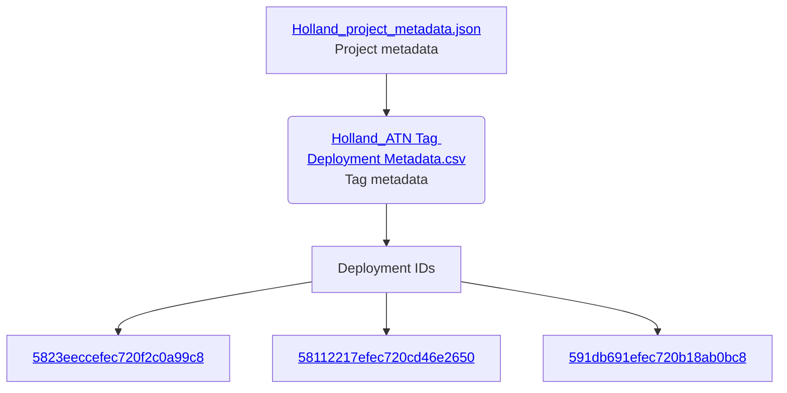
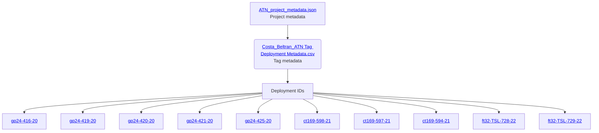
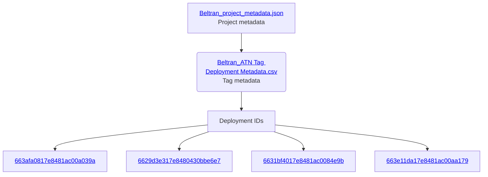

This file describes the relationships of the other files in the [ATN](https://github.com/ocean-tracking-network/rt-sat-to-obis/tree/main/input/ATN) folder.

#### London Project
Wildlife Computers SPLASH-F-391 tags

#### Holland Project
Wildlife Computers SCOUT-TEMP-361A tags

#### Costa Beltran Project
SMRU GPS SRDL, CTD SRDL and CTD/F SRDL tags

#### Beltran Project
Wildlife Computers SCOUT-DSA tags

